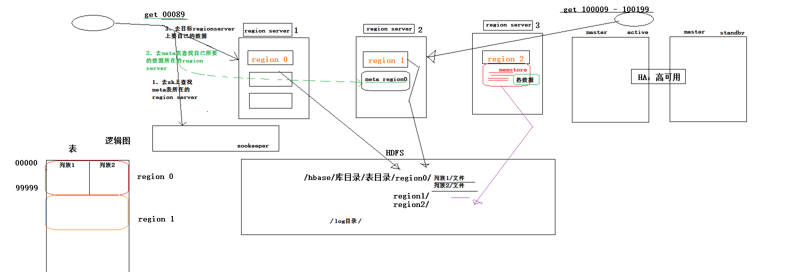

## 1 Hbase基本介绍

`Hbase`是一个分布式数据库,可以提供数据的实时随机读写。

`Hbase`与`mysql`、`oralce`、`db2`、`sqlserver`等关系型数据库不同，它是一个`NoSQL`数据库（非关系型数据库）,并且有如下特点：

- `Hbase`的表模型与关系型数据库的表模型不同：
- `Hbase`的表没有固定的字段定义；
- `Hbase`的表中每行存储的都是一些`key-value`对
- `Hbase`的表中有列族的划分，用户可以指定将哪些kv插入哪个列族
- `Hbase`的表在物理存储上，是按照列族来分割的，不同列族的数据一定存储在不同的文件中
- `Hbase`的表中的每一行都固定有一个行键，而且每一行的行键在表中不能重复
- `Hbase`中的数据，包含行键，包含`key`，包含`value`，都是`byte[ ]`类型，`hbase`不负责为用户维护数据类型
- `Hbase`对事务的支持很差

`HBASE`相比于其他nosql数据库(`mongodb`、`redis`、`cassendra`、`hazelcast`)的特点：
因为`Hbase`的表数据存储在`HDFS`文件系统中,所以存储容量可以线性扩展； 数据存储的安全性可靠性极高！

## 2 hbase的表结构
|rowkey:行键|base_info|extra_info|
|:--|:--|:--|
|001|name:zs,age:22,sex:male|hobbiy:read,addr:beijing|
|002|name:laowang,sex:male||


hbase的表模型跟mysql之类的关系型数据库的表模型差别巨大

hbase的表模型中有：行的概念；但没有字段的概念

行中存的都是key-value对，每行中的key-value对中的key可以是各种各样，每行中的key-value对的数量也可以是各种各样

hbase表模型的要点

- 一个表，有表名
- 一个表可以分为多个列族（不同列族的数据会存储在不同文件中）
- 表中的每一行有一个“行键rowkey”，而且行键在表中不能重复
- 表中的每一对`key-value`叫做一个`cell`
- hbase可以对数据存储多个历史版本（历史版本数量可配置），默认取最新的版本
- 整张表由于数据量过大，会被横向切分成若干个region（用rowkey范围标识），不同region的数据也存储在不同文件中


hbase会对插入的数据按顺序存储：
- 首先会按行键排序
- 同一行里面的kv会按列族排序，再按k排序


hbase的表数据类型

hbase中只支持byte[] ,此处的byte[] 包括了： rowkey,key,value,列族名,表名


## 3 hbase工作机制

表划分为不同的`region`，


Hbase分布式系统包含两个角色
- 管理角色：HMaster(一般2台，一台active，一台standby）
- 数据节点角色：HRegionServer（多台，和datanode在一起）

`Hbase`不做数据处理的话，不需要`yarn`，`yarn``是复制Mapreduce`计算的，`Hbase`只是负责数据管理

## 4 Hbase安装

### 4.1 安装准备

首先，要有一个`HDFS`集群，并正常运行； `Hbase`的`regionserver`应该跟`hdfs`中的`datanode`在一起
其次，还需要一个`zookeeper`集群，并正常运行,所以安装`Hbase`要先安装`zookeeper`，`zookeeper`前面已经安装过了。
然后，安装`Hbase`

### 4.2 节点安排

各个节点角色分配如下：
|节点|安装的服务|
|:--|:--|
|Master|namenode  datanode  regionserver  hmaster  zookeeper|
|Slave01|datanode  regionserver  zookeeper|
|Slave02|datanode  regionserver  zookeeper|

### 4.3 安装Hbase
解压`hbase`安装包 `hbase-2.0.5-bin.tar.gz`

修改`hbase-env.sh`
```
export JAVA_HOME=/usr/local/bigdata/java/jdk1.8.0_211

# 不启动hbase自带的zookeeper,我们自己已经装了
export HBASE_MANAGES_ZK=false
```

修改hbase-site.xml
```
<configuration>
	<!-- 指定hbase在HDFS上存储的路径 -->
	<property>
		<name>hbase.rootdir</name>
		<value>hdfs://Master:9000/hbase</value>
	</property>
	<!-- 指定hbase是分布式的 -->
	<property>
		<name>hbase.cluster.distributed</name>
		<value>true</value>
	</property>
	<!-- 指定zk的地址，多个用“,”分割 -->
	<property>
		<name>hbase.zookeeper.quorum</name>
		<value>Master:2181,Slave01:2181,Slave02:2181</value>
	</property>
</configuration>
```
修改 regionservers
```
Master
Slave01
Slave02
```

修改完成后，将安装文件夹放到三个节点的`/usr/local/bigdata/`目录下

## 6 启动hbase集群

先检查`hdfs`和`zookeeper`是否正常启动，
Master：
```shell
hadoop@Master:~$ jps
4918 DataNode
2744 QuorumPeerMain
4748 NameNode
9949 Jps
5167 SecondaryNameNode
hadoop@Master:~$ /usr/local/bigdata/zookeeper-3.4.6/bin/zkServer.sh status
JMX enabled by default
Using config: /usr/local/bigdata/zookeeper-3.4.6/bin/../conf/zoo.cfg
Mode: follower

```
Slave01:
```shell
hadoop@Slave1:~$ jps
3235 QuorumPeerMain
3779 DataNode
5546 Jps
hadoop@Slave1:~$  /usr/local/bigdata/zookeeper-3.4.6/bin/zkServer.sh status
JMX enabled by default
Using config: /usr/local/bigdata/zookeeper-3.4.6/bin/../conf/zoo.cfg
Mode: leader

```

Slave02:
```shell
hadoop@Slave2:~$ jps
11958 DataNode
13656 Jps
11390 QuorumPeerMain
hadoop@Slave2:~$  /usr/local/bigdata/zookeeper-3.4.6/bin/zkServer.sh status
JMX enabled by default
Using config: /usr/local/bigdata/zookeeper-3.4.6/bin/../conf/zoo.cfg
Mode: follower

```


然后执行`start-hbase.sh`
```shell
$ bin/start-hbase.sh

```

上面的命令会启动配置文件`regionserver`里添加的所有机器，如果想手动启动其中一台可以用：
```shell
$ bin/hbase-daemon.sh start regionserver

```

启动完成后在Master上会启动`HRegionServer`和`HMaster`两个服务，`Slave01`和`Slave02`会启动`HMaster`服务。

高可用`Hbase`集群应配置两台`master`一台处于`active`状态一台处于`standby`状态，用于监听`regionserver` 

可以再从另外两条机器中再启动一个`HRegionServer`服务。

```shell
$ bin/hbase-daemon.sh start master

```
新启的这个master会处于backup状态

## 7 启动hbase的命令行客户端


使用命令`hbase shell`
```shell
bin/hbase shell
Hbase> list     // 查看表
Hbase> status   // 查看集群状态
Hbase> version  // 查看集群版本
```


##### 问题
```
ERROR: org.apache.hadoop.hbase.ipc.ServerNotRunningYetException: Server is not running yet
        at org.apache.hadoop.hbase.master.HMaster.checkServiceStarted(HMaster.java:2932)
        at org.apache.hadoop.hbase.master.MasterRpcServices.isMasterRunning(MasterRpcServices.java:1084)
        at org.apache.hadoop.hbase.shaded.protobuf.generated.MasterProtos$MasterService$2.callBlockingMethod(MasterProtos.java)
        at org.apache.hadoop.hbase.ipc.RpcServer.call(RpcServer.java:413)
        at org.apache.hadoop.hbase.ipc.CallRunner.run(CallRunner.java:130)
        at org.apache.hadoop.hbase.ipc.RpcExecutor$Handler.run(RpcExecutor.java:324)
        at org.apache.hadoop.hbase.ipc.RpcExecutor$Handler.run(RpcExecutor.java:304)

```

##### 解决
```
$ hdfs dfsadmin -safemode leave

```


## 8 hbase命令行客户端操作
### 8.1 建表
```
create 't_user_info','base_info','extra_info'
         表名      列族名   列族名
		 
```

### 8.2 插入数据：
```
hbase(main):011:0> put 't_user_info','001','base_info:username','zhangsan'
0 row(s) in 0.2420 seconds

hbase(main):012:0> put 't_user_info','001','base_info:age','18'
0 row(s) in 0.0140 seconds

hbase(main):013:0> put 't_user_info','001','base_info:sex','female'
0 row(s) in 0.0070 seconds

hbase(main):014:0> put 't_user_info','001','extra_info:career','it'
0 row(s) in 0.0090 seconds

hbase(main):015:0> put 't_user_info','002','extra_info:career','actoress'
0 row(s) in 0.0090 seconds

hbase(main):016:0> put 't_user_info','002','base_info:username','liuyifei'
0 row(s) in 0.0060 seconds
```

### 8.3 查询数据方式一：scan 扫描
```
hbase(main):017:0> scan 't_user_info'
ROW                               COLUMN+CELL                                                                                     
 001                              column=base_info:age, timestamp=1496567924507, value=18                                         
 001                              column=base_info:sex, timestamp=1496567934669, value=female                                     
 001                              column=base_info:username, timestamp=1496567889554, value=zhangsan                              
 001                              column=extra_info:career, timestamp=1496567963992, value=it                                     
 002                              column=base_info:username, timestamp=1496568034187, value=liuyifei                              
 002                              column=extra_info:career, timestamp=1496568008631, value=actoress                               
2 row(s) in 0.0420 seconds
```

### 8.4 查询数据方式二：get 单行数据
```
hbase(main):020:0> get 't_user_info','001'
COLUMN                            CELL                                                                                            
 base_info:age                    timestamp=1496568160192, value=19                                                               
 base_info:sex                    timestamp=1496567934669, value=female                                                           
 base_info:username               timestamp=1496567889554, value=zhangsan                                                         
 extra_info:career                timestamp=1496567963992, value=it                                                               
4 row(s) in 0.0770 seconds
```

### 8.5 删除一个kv数据
```
hbase(main):021:0> delete 't_user_info','001','base_info:sex'
0 row(s) in 0.0390 seconds

删除整行数据：
hbase(main):024:0> deleteall 't_user_info','001'
0 row(s) in 0.0090 seconds

hbase(main):025:0> get 't_user_info','001'
COLUMN                            CELL                                                                                            
0 row(s) in 0.0110 seconds

3.4.1.6.	删除整个表：
hbase(main):028:0> disable 't_user_info'
0 row(s) in 2.3640 seconds

hbase(main):029:0> drop 't_user_info'
0 row(s) in 1.2950 seconds

hbase(main):030:0> list
TABLE                                                                                                                             
0 row(s) in 0.0130 seconds

=> []
```

### 8.6 Hbase重要特性--排序特性（行键）

插入到`hbase`中去的数据，`hbase`会自动排序存储：
排序规则：  首先看行键，然后看列族名，然后看列（`key`）名； 按字典顺序

Hbase的这个特性跟查询效率有极大的关系

比如：一张用来存储用户信息的表，有名字，户籍，年龄，职业....等信息
然后，在业务系统中经常需要：
查询某个省的所有用户
经常需要查询某个省的指定姓的所有用户

思路：如果能将相同省的用户在`hbase`的存储文件中连续存储，并且能将相同省中相同姓的用户连续存储，那么，上述两个查询需求的效率就会提高！！！

做法：将查询条件拼到`rowkey`内


## 9 HBASE客户端API操作

### 9.1 DDL操作
代码流程：

- 创建一个连接：`Connection conn = ConnectionFactory.createConnection(conf);`
- 拿到一个DDL操作器：表管理器：`adminAdmin admin = conn.getAdmin();`
- 用表管理器的api去建表、删表、修改表定义：`admin.createTable(HTableDescriptor descriptor);`

```java
@Before
public void getConn() throws Exception{
	// 构建一个连接对象
	Configuration conf = HBaseConfiguration.create(); // 会自动加载hbase-site.xml
	conf.set("hbase.zookeeper.quorum", "192.168.233.200:2181,192.168.233.201:2181,192.168.233.202:2181");
	
	conn = ConnectionFactory.createConnection(conf);
}


/**
 * DDL
 * @throws Exception 
 */
@Test
public void testCreateTable() throws Exception{

	// 从连接中构造一个DDL操作器
	Admin admin = conn.getAdmin();
	
	// 创建一个表定义描述对象
	HTableDescriptor hTableDescriptor = new HTableDescriptor(TableName.valueOf("user_info"));
	
	// 创建列族定义描述对象
	HColumnDescriptor hColumnDescriptor_1 = new HColumnDescriptor("base_info");
	hColumnDescriptor_1.setMaxVersions(3); // 设置该列族中存储数据的最大版本数,默认是1
	
	HColumnDescriptor hColumnDescriptor_2 = new HColumnDescriptor("extra_info");
	
	// 将列族定义信息对象放入表定义对象中
	hTableDescriptor.addFamily(hColumnDescriptor_1);
	hTableDescriptor.addFamily(hColumnDescriptor_2);
	
	
	// 用ddl操作器对象：admin 来建表
	admin.createTable(hTableDescriptor);
	
	// 关闭连接
	admin.close();
	conn.close();
	
}


/**
 * 删除表
 * @throws Exception 
 */
@Test
public void testDropTable() throws Exception{
	
	Admin admin = conn.getAdmin();
	
	// 停用表
	admin.disableTable(TableName.valueOf("user_info"));
	// 删除表
	admin.deleteTable(TableName.valueOf("user_info"));
	
	
	admin.close();
	conn.close();
}

// 修改表定义--添加一个列族
@Test
public void testAlterTable() throws Exception{
	
	Admin admin = conn.getAdmin();
	
	// 取出旧的表定义信息
	HTableDescriptor tableDescriptor = admin.getTableDescriptor(TableName.valueOf("user_info"));
	
	
	// 新构造一个列族定义
	HColumnDescriptor hColumnDescriptor = new HColumnDescriptor("other_info");
	hColumnDescriptor.setBloomFilterType(BloomType.ROWCOL); // 设置该列族的布隆过滤器类型
	
	// 将列族定义添加到表定义对象中
	tableDescriptor.addFamily(hColumnDescriptor);
	
	
	// 将修改过的表定义交给admin去提交
	admin.modifyTable(TableName.valueOf("user_info"), tableDescriptor);
	
	
	admin.close();
	conn.close();
	
}

```

### 9.2 DML操作

`HBase`的增删改查
```
	Connection conn = null;
	
	@Before
	public void getConn() throws Exception{
		// 构建一个连接对象
		Configuration conf = HBaseConfiguration.create(); // 会自动加载hbase-site.xml
		conf.set("hbase.zookeeper.quorum", "Master:2181,Slave01:2181,Slave02:2181");
		
		conn = ConnectionFactory.createConnection(conf);
	}
	
	
	/**
	 * 增
	 * 改:put来覆盖
	 * @throws Exception 
	 */
	@Test
	public void testPut() throws Exception{
		
		// 获取一个操作指定表的table对象,进行DML操作
		Table table = conn.getTable(TableName.valueOf("user_info"));
		
		// 构造要插入的数据为一个Put类型(一个put对象只能对应一个rowkey)的对象
		Put put = new Put(Bytes.toBytes("001"));
		put.addColumn(Bytes.toBytes("base_info"), Bytes.toBytes("username"), Bytes.toBytes("张三"));
		put.addColumn(Bytes.toBytes("base_info"), Bytes.toBytes("age"), Bytes.toBytes("18"));
		put.addColumn(Bytes.toBytes("extra_info"), Bytes.toBytes("addr"), Bytes.toBytes("北京"));
		
		
		Put put2 = new Put(Bytes.toBytes("002"));
		put2.addColumn(Bytes.toBytes("base_info"), Bytes.toBytes("username"), Bytes.toBytes("李四"));
		put2.addColumn(Bytes.toBytes("base_info"), Bytes.toBytes("age"), Bytes.toBytes("28"));
		put2.addColumn(Bytes.toBytes("extra_info"), Bytes.toBytes("addr"), Bytes.toBytes("上海"));
	
		
		ArrayList<Put> puts = new ArrayList<>();
		puts.add(put);
		puts.add(put2);
		
		
		// 插进去
		table.put(puts);
		
		table.close();
		conn.close();
		
	}
	
	
	/**
	 * 循环插入大量数据
	 * @throws Exception 
	 */
	@Test
	public void testManyPuts() throws Exception{
		
		Table table = conn.getTable(TableName.valueOf("user_info"));
		ArrayList<Put> puts = new ArrayList<>();
		
		for(int i=0;i<100000;i++){
			Put put = new Put(Bytes.toBytes(""+i));
			put.addColumn(Bytes.toBytes("base_info"), Bytes.toBytes("username"), Bytes.toBytes("张三"+i));
			put.addColumn(Bytes.toBytes("base_info"), Bytes.toBytes("age"), Bytes.toBytes((18+i)+""));
			put.addColumn(Bytes.toBytes("extra_info"), Bytes.toBytes("addr"), Bytes.toBytes("北京"));
			
			puts.add(put);
		}
		
		table.put(puts);
		
	}
	
	/**
	 * 删
	 * @throws Exception 
	 */
	@Test
	public void testDelete() throws Exception{
		Table table = conn.getTable(TableName.valueOf("user_info"));
		
		// 构造一个对象封装要删除的数据信息
		Delete delete1 = new Delete(Bytes.toBytes("001"));
		
		Delete delete2 = new Delete(Bytes.toBytes("002"));
		delete2.addColumn(Bytes.toBytes("extra_info"), Bytes.toBytes("addr"));
		
		ArrayList<Delete> dels = new ArrayList<>();
		dels.add(delete1);
		dels.add(delete2);
		
		table.delete(dels);
		
		
		table.close();
		conn.close();
	}
	
	/**
	 * 查
	 * @throws Exception 
	 */
	@Test
	public void testGet() throws Exception{
		
		Table table = conn.getTable(TableName.valueOf("user_info"));
		
		Get get = new Get("002".getBytes());
		
		Result result = table.get(get);
		
		// 从结果中取用户指定的某个key的value
		byte[] value = result.getValue("base_info".getBytes(), "age".getBytes());
		System.out.println(new String(value));
		
		System.out.println("-------------------------");
		
		// 遍历整行结果中的所有kv单元格
		CellScanner cellScanner = result.cellScanner();
		while(cellScanner.advance()){
			Cell cell = cellScanner.current();
			
			byte[] rowArray = cell.getRowArray();  //本kv所属的行键的字节数组
			byte[] familyArray = cell.getFamilyArray();  //列族名的字节数组
			byte[] qualifierArray = cell.getQualifierArray();  //列名的字节数据
			byte[] valueArray = cell.getValueArray(); // value的字节数组
			
			System.out.println("行键: "+new String(rowArray,cell.getRowOffset(),cell.getRowLength()));
			System.out.println("列族名: "+new String(familyArray,cell.getFamilyOffset(),cell.getFamilyLength()));
			System.out.println("列名: "+new String(qualifierArray,cell.getQualifierOffset(),cell.getQualifierLength()));
			System.out.println("value: "+new String(valueArray,cell.getValueOffset(),cell.getValueLength()));
			
		}
		
		table.close();
		conn.close();
		
	}
	
	
	/**
	 * 按行键范围查询数据
	 * @throws Exception 
	 */
	@Test
	public void testScan() throws Exception{
		
		Table table = conn.getTable(TableName.valueOf("user_info"));
		
		// 包含起始行键，不包含结束行键,但是如果真的想查询出末尾的那个行键，那么，可以在末尾行键上拼接一个不可见的字节（\000）
		Scan scan = new Scan("10".getBytes(), "10000\001".getBytes());
		
		ResultScanner scanner = table.getScanner(scan);
		
		Iterator<Result> iterator = scanner.iterator();
		
		while(iterator.hasNext()){
			
			Result result = iterator.next();
			// 遍历整行结果中的所有kv单元格
			CellScanner cellScanner = result.cellScanner();
			while(cellScanner.advance()){
				Cell cell = cellScanner.current();
				
				byte[] rowArray = cell.getRowArray();  //本kv所属的行键的字节数组
				byte[] familyArray = cell.getFamilyArray();  //列族名的字节数组
				byte[] qualifierArray = cell.getQualifierArray();  //列名的字节数据
				byte[] valueArray = cell.getValueArray(); // value的字节数组
				
				System.out.println("行键: "+new String(rowArray,cell.getRowOffset(),cell.getRowLength()));
				System.out.println("列族名: "+new String(familyArray,cell.getFamilyOffset(),cell.getFamilyLength()));
				System.out.println("列名: "+new String(qualifierArray,cell.getQualifierOffset(),cell.getQualifierLength()));
				System.out.println("value: "+new String(valueArray,cell.getValueOffset(),cell.getValueLength()));
			}
			System.out.println("----------------------");
		}
	}
	
	@Test
	public void test(){
		String a = "000";
		String b = "000\0";
		
		System.out.println(a);
		System.out.println(b);
		
		
		byte[] bytes = a.getBytes();
		byte[] bytes2 = b.getBytes();
		
		System.out.println("");
		
	}
	
	
```
