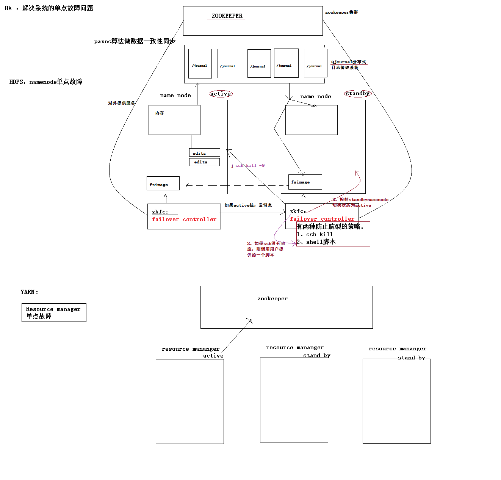
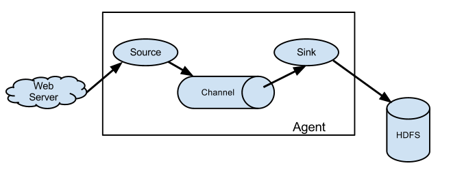

# Flume日志采集框架

在一个完整的离线大数据处理系统中，除了hdfs+mapreduce+hive组成分析系统的核心之外，还需要数据采集、结果数据导出、任务调度等不可或缺的辅助系统，而这些辅助工具在hadoop生态体系中都有便捷的开源框架，如图所示：




## 1 Flume介绍

`Flume`是一个分布式、可靠、和高可用的海量日志采集、聚合和传输的系统。`Flume`可以采集文件，`socket`数据包、文件、文件夹、`kafka`等各种形式源数据，又可以将采集到的数据(下沉`sink`)输出到`HDFS`、`hbase`、`hive`、`kafka`等众多外部存储系统中。

对于一般的采集需求，通过对flume的简单配置即可实现。

`Flume`针对特殊场景也具备良好的自定义扩展能力，因此，`flume`可以适用于大部分的日常数据采集场景。

## 2 Flume运行机制
`Flume`分布式系统中最核心的角色是`agent`，`flume`采集系统就是由一个个`agent`所连接起来形成,每一个`agent`相当于一个数据传递员，内部有三个组件：
- `Source`：采集组件，用于跟数据源对接，以获取数据
- `Sink`：下沉组件，用于往下一级`agent`传递数据或者往最终存储系统传递数据
- `Channel`：传输通道组件，用于从`source`将数据传递到`sink`

单个agent采集数据:




多级agent之间串联:


## 3 Flume的安装部署

1 下载安装包`apache-flume-1.9.0-bin.tar.gz`解压

2 在`conf`文件夹下的`flume-env.sh`添加`JAVA_HOME`

```shell
export JAVA_HOME=/usr/local/bigdata/java/jdk1.8.0_211

```

3 根据采集的需求，添加采集方案配置文件，文件名可以任意取

具体可以看后面的示例

4 启动`flume`

测试环境下：
```
$ bin/flume/-ng agent -c conf/ -f ./dir-hdfs.conf -n agent1 -Dflume.root.logger=INFO,console

```
命令说明：
- `-c`：指定flume自带的配置文件目录，不用自己修改
- `-f`：指定自己的配置文件,这里问当前文件夹下的`dir-hdfs.conf`
- `-n`：指定自己配置文件中使用那个`agent`,对应的配置文件中定义的名字。
- `-Dflume.root.logger`：把日志打印在控制台，类型为`INFO`，这个只用于测试，后面将打印到日志文件中


生产中，启动flume，应该把flume启动在后台：
```
nohup bin/flume-ng  agent  -c  ./conf  -f ./dir-hdfs.conf -n  agent1 1>/dev/null 2>&1 &
```


## 4 采集静态文件到hdfs

### 4.1 采集需求

某服务器的某特定目录下，会不断产生新的文件，每当有新文件出现，就需要把文件采集到HDFS中去

### 4.2 添加配置文件
在安装目录下添加文件`dir-hdfs.conf`,然后添加配置信息。

先获取`agent`，命名为`agent1`，后面的配置都跟在`agent1`后面，也可以改为其他值，如`agt1`,同一个配置文件中可以有多个配置配置方案，启动`agent`的时候获取对应的名字就可以。

根据需求，首先定义以下3大要素

##### 数据源组件

即`source` ——监控文件目录 :  `spooldir`
`spooldir`有如下特性：
- 监视一个目录，只要目录中出现新文件，就会采集文件中的内容
- 采集完成的文件，会被agent自动添加一个后缀：`COMPLETED`（可修改）
- 所监视的目录中不允许重复出现相同文件名的文件

##### 下沉组件

即`sink——HDFS`文件系统  :  `hdfs sink`

##### 通道组件

即`channel`——可用`file channel` 也可以用内存`channel`

```
#定义三大组件的名称
agent1.sources = source1
agent1.sinks = sink1
agent1.channels = channel1

# 配置source组件
agent1.sources.source1.type = spooldir
agent1.sources.source1.spoolDir = /root/log/
agent1.sources.source1.fileSuffix=.FINISHED
#文件每行的长度，注意这里如果事情文件每行超过这个长度会自动切断，会导致数据丢失
agent1.sources.source1.deserializer.maxLineLength=5120

# 配置sink组件
agent1.sinks.sink1.type = hdfs
agent1.sinks.sink1.hdfs.path =hdfs://Master:9000/access_log/%y-%m-%d/%H-%M
agent1.sinks.sink1.hdfs.filePrefix = app_log
agent1.sinks.sink1.hdfs.fileSuffix = .log
agent1.sinks.sink1.hdfs.batchSize= 100
agent1.sinks.sink1.hdfs.fileType = DataStream
agent1.sinks.sink1.hdfs.writeFormat =Text

# roll：滚动切换：控制写文件的切换规则
## 按文件体积（字节）来切 
agent1.sinks.sink1.hdfs.rollSize = 512000
## 按event条数切
agent1.sinks.sink1.hdfs.rollCount = 1000000
## 按时间间隔切换文件
agent1.sinks.sink1.hdfs.rollInterval = 60

## 控制生成目录的规则
agent1.sinks.sink1.hdfs.round = true
agent1.sinks.sink1.hdfs.roundValue = 10
agent1.sinks.sink1.hdfs.roundUnit = minute

agent1.sinks.sink1.hdfs.useLocalTimeStamp = true

# channel组件配置
agent1.channels.channel1.type = memory
## event条数
agent1.channels.channel1.capacity = 500000
##flume事务控制所需要的缓存容量600条event
agent1.channels.channel1.transactionCapacity = 600

# 绑定source、channel和sink之间的连接
agent1.sources.source1.channels = channel1
agent1.sinks.sink1.channel = channel1

```

`Channel`参数解释：
- `capacity`：默认该通道中最大的可以存储的`event`数量
- `trasactionCapacity`：每次最大可以从`source`中拿到或者送到`sink`中的`event`数量
- `keep-alive`：`event`添加到通道中或者移出的允许时间


### 4.3启动flume
```
$ bin/flume/-ng agent -c conf/ -f dir-hdfs.conf -n agent1 -Dflume.root.logger=INFO,console

```

## 5 采集动态日志文件到hdfs


### 5.1 采集需求

比如业务系统使用log4j生成的日志，日志内容不断增加，需要把追加到日志文件中的数据实时采集到hdfs

### 5.2 配置文件

配置文件名称：`tail-hdfs.conf`
根据需求，首先定义以下3大要素：
- 采集源，即`source`——监控文件内容更新 :  `exec`  `tail -F file`
- 下沉目标，即`sink——HDFS`文件系统  :  hdfs sink
- `Source`和`sink`之间的传递通道——`channel`，可用`file channel` 也可以用 内存`channel`

配置文件内容：
```

# Name the components on this agent
a1.sources = r1
a1.sinks = k1
a1.channels = c1

# Describe/configure the source
a1.sources.r1.type = exec
a1.sources.r1.command = tail -F /root/app_weichat_login.log

# Describe the sink
agent1.sinks.sink1.type = hdfs
agent1.sinks.sink1.hdfs.path =hdfs://Master:9000/app_weichat_login_log/%y-%m-%d/%H-%M
agent1.sinks.sink1.hdfs.filePrefix = weichat_log
agent1.sinks.sink1.hdfs.fileSuffix = .dat
agent1.sinks.sink1.hdfs.batchSize= 100
agent1.sinks.sink1.hdfs.fileType = DataStream
agent1.sinks.sink1.hdfs.writeFormat =Text

agent1.sinks.sink1.hdfs.rollSize = 100
agent1.sinks.sink1.hdfs.rollCount = 1000000
agent1.sinks.sink1.hdfs.rollInterval = 60

agent1.sinks.sink1.hdfs.round = true
agent1.sinks.sink1.hdfs.roundValue = 1
agent1.sinks.sink1.hdfs.roundUnit = minute


agent1.sinks.sink1.hdfs.useLocalTimeStamp = true


# Use a channel which buffers events in memory
a1.channels.c1.type = memory
a1.channels.c1.capacity = 1000
a1.channels.c1.transactionCapacity = 100

# Bind the source and sink to the channel
a1.sources.r1.channels = c1
a1.sinks.k1.channel = c1
```

### 5.3 启动flume

启动命令：
```
bin/flume-ng agent -c conf -f conf/tail-hdfs.conf -n a1

```


## 6 两个agent级联


从tail命令获取数据发送到avro端口
另一个节点可配置一个avro源来中继数据，发送外部存储

```
# Name the components on this agent
a1.sources = r1
a1.sinks = k1
a1.channels = c1

# Describe/configure the source
a1.sources.r1.type = exec
a1.sources.r1.command = tail -F /root/log/access.log


# Describe the sink
a1.sinks.k1.type = avro
a1.sinks.k1.hostname = hdp-05
a1.sinks.k1.port = 4141
a1.sinks.k1.batch-size = 2


# Use a channel which buffers events in memory
a1.channels.c1.type = memory
a1.channels.c1.capacity = 1000
a1.channels.c1.transactionCapacity = 100

# Bind the source and sink to the channel
a1.sources.r1.channels = c1
a1.sinks.k1.channel = c1
```


从avro端口接收数据，下沉到`hdfs`


采集配置文件，`avro-hdfs.conf`
```
# Name the components on this agent
a1.sources = r1
a1.sinks = k1
a1.channels = c1

# Describe/configure the source
##source中的avro组件是一个接收者服务
a1.sources.r1.type = avro
a1.sources.r1.bind = hdp-05
a1.sources.r1.port = 4141


# Describe the sink
a1.sinks.k1.type = hdfs
a1.sinks.k1.hdfs.path = /flume/taildata/%y-%m-%d/
a1.sinks.k1.hdfs.filePrefix = tail-
a1.sinks.k1.hdfs.round = true
a1.sinks.k1.hdfs.roundValue = 24
a1.sinks.k1.hdfs.roundUnit = hour
a1.sinks.k1.hdfs.rollInterval = 0
a1.sinks.k1.hdfs.rollSize = 0
a1.sinks.k1.hdfs.rollCount = 50
a1.sinks.k1.hdfs.batchSize = 10
a1.sinks.k1.hdfs.useLocalTimeStamp = true
#生成的文件类型，默认是Sequencefile，可用DataStream，则为普通文本
a1.sinks.k1.hdfs.fileType = DataStream

# Use a channel which buffers events in memory
a1.channels.c1.type = memory
a1.channels.c1.capacity = 1000
a1.channels.c1.transactionCapacity = 100

# Bind the source and sink to the channel
a1.sources.r1.channels = c1
a1.sinks.k1.channel = c1
```

