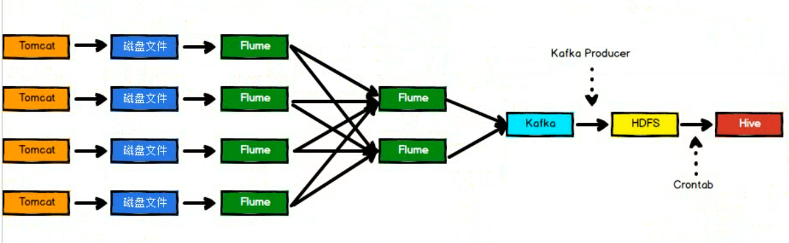
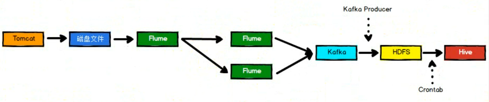

# 手机APP分析系统


## 1 代码结构：
- tomcat_servelet:  servelet代码
- data_producer:    模拟日志数据生产
- taildirsourse：   Flume移植代码
- log-analysis：    日志处理代码


## 2 Flume代码移植

由于 Flume 1.6 版本没有 Taildir Source
组件，因此，需要将 Flume 1.7 中的 Taildir Source 组件源码编译打包后，放入 Flume1.6 安装
目录的 lib 文件目录下。

所谓移植，就是将 Flume1.7 版本中 Taildir Source 的相关文件全部提取出来，然后将这
些文件放入新建的项目中进行编译打包，将打包出的 jar 包放入 Flume1.6 安装目录的 lib 目
录下即可。

在本项目中，已经将 Taildir Source 的源码放入了 taildirsource 项目中，直接编译项目，
打包后放入 Flume1.6 安装目录的 lib 文件目录下即可。
在 Flume 配置文件中指定全类名即可使用 Taildir Source 组件。
```s
a1.sources.r1.type = com.atguigu.flume.source.TaildirSource

```

打包：

在IDEA中，打开taildirsource项目，点击右侧的maven先双击`clean`然后双击`package`打包，之后变回在target目录下生成一个`flume-taildirsource.jar`文件


## 3 项目配置

在一台机器上安装一个nginx和两个tomcat

### 3.1 Nginx 安装

**注意使用root用户**

#### 3.1.1 安装PCRE
```
#下载 PCRE 安装包

wget http://downloads.sourceforge.net/project/pcre/pcre/8.35/pcre-8.35.tar.gz

#解压安装包
tar zxvf pcre-8.35.tar.gz

进入安装包目录
cd pcre-8.35

#编译安装
./configure

#安装
make && make install

# 查看 pcre 版本
pcregrep -V
```

**ubuntu 下直接apt-get 安装如下库即可,不需要进行上面的操作：**
 ```sh
#PCRE库
$ sudo apt-get install libpcre3 libpcre3-dev  

#zlib库
$ sudo apt-get install zlib1g-dev

#OpenSSL库
$ sudo apt-get install openssl libssl-dev 
```


#### 3.1.2 安装nginx

安装,用root用户
```
wget http://nginx.org/download/nginx-1.12.2.tar.gz

tar zxvf nginx-1.12.2.tar.gz

cd nginx-1.12.2

./configure --prefix=/usr/local/nginx 

make && make install
```

 查看 Nginx 版本
 ```
 /usr/local/nginx/sbin/nginx -v
 ```


 #### 3.1.2 nginx负载均衡配置

conf/nginx.conf

```conf
#user  nobody;
worker_processes  1;

#error_log logs/error.log;
#error_log logs/error.log notice;
#error_log logs/error.log info;

#pid logs/nginx.pid;

events {
    worker_connections  1024;
}


http {
    include       mime.types;
    default_type  application/octet-stream;


    sendfile        on;
    #tcp_nopush     on;

    #keepalive_timeout  0;
    keepalive_timeout  65;

    #服务器的集群 
    upstream netitcast.com { 
        #服务器集群名字 
        #服务器配置 weight 是权重的意思，权重越大，分配的概率越大。
        server 192.168.1.112:18080; 
        server 192.168.1.112:28080; 
    } 


    #gzip  on;

    server {
        listen       80;
        server_name  localhost;

        #charset koi8-r;

        #access_log  logs/host.access.log  main;

        location / {
            # root   html;
            # index  index.html index.htm;
            proxy_pass http://netitcast.com;
            proxy_redirect default;
        }

        #error_page  404              /404.html
        # redirect server error pages to the static page /50x.html
        #
        error_page   500 502 503 504  /50x.html;
        location = /50x.html {
            root   html;
        }
    }
}
```

### 3.2 Tomcat安装
**用普通用户安装**
#### 3.2.1 安装
```
sudo chown -R ubuntu:ubuntu /opt/modules/
tar -zxvf apache-tomcat-7.0.72.tar.gz -C /opt/modules/
cd /opt/modules
mv apache-tomcat-7.0.72/ apache-tomcat-7.0.72_01
cp -r apache-tomcat-7.0.72_01 apache-tomcat-7.0.72_02
```

#### 3.2.2 修改配置文件 conf/server.xml
tomcat_1：
```xml
<?xml version='1.0' encoding='utf-8'?>

<Server port="18005" shutdown="SHUTDOWN">
  <Listener className="org.apache.catalina.startup.VersionLoggerListener" />

  <Listener className="org.apache.catalina.core.AprLifecycleListener" SSLEngine="on" />

  <Listener className="org.apache.catalina.core.JasperListener" />
  <Listener className="org.apache.catalina.core.JreMemoryLeakPreventionListener" />
  <Listener className="org.apache.catalina.mbeans.GlobalResourcesLifecycleListener" />
  <Listener className="org.apache.catalina.core.ThreadLocalLeakPreventionListener" />


  <GlobalNamingResources>

    <Resource name="UserDatabase" auth="Container"
              type="org.apache.catalina.UserDatabase"
              description="User database that can be updated and saved"
              factory="org.apache.catalina.users.MemoryUserDatabaseFactory"
              pathname="conf/tomcat-users.xml" />
  </GlobalNamingResources>

  <Service name="Catalina">
    <Connector port="18080" protocol="HTTP/1.1"
               connectionTimeout="20000"
               redirectPort="8443" />
    <Connector port="18009" protocol="AJP/1.3" redirectPort="8443" />

    <Engine name="Catalina" defaultHost="localhost">

      <Realm className="org.apache.catalina.realm.LockOutRealm">
        <Realm className="org.apache.catalina.realm.UserDatabaseRealm"
               resourceName="UserDatabase"/>
      </Realm>

      <Host name="localhost"  appBase="webapps"
            unpackWARs="true" autoDeploy="true">
        <Valve className="org.apache.catalina.valves.AccessLogValve" directory="logs"
               prefix="localhost_access_log." suffix=".txt"
               pattern="%h %l %u %t &quot;%r&quot; %s %b" />

      </Host>
    </Engine>
  </Service>
</Server>

```

tomcat_2:
```xml

<?xml version='1.0' encoding='utf-8'?>
<Server port="28005" shutdown="SHUTDOWN">
  <Listener className="org.apache.catalina.startup.VersionLoggerListener" />
  <Listener className="org.apache.catalina.core.AprLifecycleListener" SSLEngine="on" />
  <Listener className="org.apache.catalina.core.JasperListener" />
  <Listener className="org.apache.catalina.core.JreMemoryLeakPreventionListener" />
  <Listener className="org.apache.catalina.mbeans.GlobalResourcesLifecycleListener" />
  <Listener className="org.apache.catalina.core.ThreadLocalLeakPreventionListener" />

  <GlobalNamingResources>
    <Resource name="UserDatabase" auth="Container"
              type="org.apache.catalina.UserDatabase"
              description="User database that can be updated and saved"
              factory="org.apache.catalina.users.MemoryUserDatabaseFactory"
              pathname="conf/tomcat-users.xml" />
  </GlobalNamingResources>

  <Service name="Catalina">

    <Connector port="28080" protocol="HTTP/1.1"
               connectionTimeout="20000"
               redirectPort="8443" />
    <Connector port="28009" protocol="AJP/1.3" redirectPort="8443" />
    <Engine name="Catalina" defaultHost="localhost">
      <Realm className="org.apache.catalina.realm.LockOutRealm">
        <Realm className="org.apache.catalina.realm.UserDatabaseRealm"
               resourceName="UserDatabase"/>
      </Realm>

      <Host name="localhost"  appBase="webapps"
            unpackWARs="true" autoDeploy="true">
        <Valve className="org.apache.catalina.valves.AccessLogValve" directory="logs"
               prefix="localhost_access_log." suffix=".txt"
               pattern="%h %l %u %t &quot;%r&quot; %s %b" />
      </Host>
    </Engine>
  </Service>
</Server>
```


### 3.3 Tomcat部署

### 3.3.1 部署tomcat_servelet代码到tomcat

修改tomcat_serverlet项目中log4j.properties文件的log4j.appender.atguigu.File.file属性，分别打war包放入两个tomcat中。
放入 Tomcat 安装目录的 webapps 目录下，之后会自
动解压，生成对应的目录，完成部署后需要重启 Tomcat 从而使部署生效。

打包过程：

在 tomcat_serverlet 项目中点选择 log-collectr-common 点击右侧的maven（Lifecycle)：【clean】--> 【package】-->【install】(install会将包安装在maven仓库中)；

然后选择log-collector-web，同样在右侧的maven(Lifecycle里)：【clean】-->【package】，切换到Plugins，选择【war/war:war】打一个war包。

### 3.3.2 启动tomcat和nginx

启动tomcat：
```
/opt/modules/apache-tomcat-7.0.72_01/bin/startup.sh && /opt/modules/apache-tomcat-7.0.72_02/bin/startup.sh

```

停止tomcat：
```
/opt/modules/apache-tomcat-7.0.72_01/bin/shutdown.sh && /opt/modules/apache-tomcat-7.0.72_02/bin/shutdown.sh

```


启动nginx:
```
sudo /usr/local/nginx/sbin/nginx

```

停止nginx：
```
sudo /usr/local/nginx/sbin/nginx -s stop

```

### 3.3.3 运行模拟日志发送程序
启动 data_producer 项目中的 GenBeahavior 程序，开始模拟日志的发送。

运行模型程序后，会在/opt/modules/apache-tomcat-7.0.72_01/logs/LogsCollect和/opt/modules/apache-tomcat-7.0.72_01/logs/LogsCollect目录下交替生成日志。

可以使用 ` tail -F atguigu.log`进行查看。


## 4 Flume配置

**注意将flume-atguigu-taildirsource.jar文件拷贝到lib目录下**

完整的框架图如下，目前已经完成了从tomcat到数据落盘的过程，接下来是flume的配置。


在前面的配置中我们使用了两个tomcat以及一个nginx做负载均衡。下面的配置过程讲对上面的框架图进行简化，具体如下：



第一层flume跟tocat在一台机器上用于采集tomcat中的数据，第二层的两个Flume分别安装在另外两台机器上。
### 4.1 第一层Flume

```conf
a1.sources = r1
a1.channels = c1

a1.sinkgroups = g1
a1.sinks = k1 k2

a1.sources.r1.type = com.atguigu.flume.source.TaildirSource
a1.sources.r1.channels = c1
a1.sources.r1.positionFile = /usr/local/bigdata/flume-1.6.0/checkpoint/behavior/taildir_position.json
a1.sources.r1.filegroups = f1
# 多个文件用 .*
a1.sources.r1.filegroups.f1 = /opt/modules/apache-tomcat-7.0.72_01/logs/LogsCollect/atguigu.log
a1.sources.r1.fileHeader = true

a1.channels.c1.type = file
a1.channels.c1.checkpointDir = /usr/local/bigdata/flume-1.6.0/checkpoint/behavior
a1.channels.c1.dataDirs = /usr/local/bigdata/flume-1.6.0/data/behavior/
a1.channels.c1.maxFileSize = 104857600
a1.channels.c1.capacity = 90000000
a1.channels.c1.keep-alive = 60

a1.sinkgroups.g1.sinks = k1 k2
a1.sinkgroups.g1.processor.type = load_balance
a1.sinkgroups.g1.processor.backoff = true
a1.sinkgroups.g1.processor.selector = round_robin
a1.sinkgroups.g1.processor.selector.maxTimeOut=10000

a1.sinks.k1.type = avro
a1.sinks.k1.channel = c1
a1.sinks.k1.batchSize = 1
a1.sinks.k1.hostname = Node03
a1.sinks.k1.port = 1234

a1.sinks.k2.type = avro
a1.sinks.k2.channel = c1
a1.sinks.k2.batchSize = 1
a1.sinks.k2.hostname = Node04
a1.sinks.k2.port = 1234
```

启动Node02下的flume：
```s
/usr/local/bigdata/flume-1.6.0/bin/flume-ng agent --conf conf/ -f conf/flume-analysis.conf -n a1

```

可以在/data/behavior目录下查看的文件

### 4.2 第二层Flume

```conf
a1.sources = r1
a1.channels = c1
a1.sinks = k1

a1.sources.r1.type = avro
a1.sources.r1.channels = c1
a1.sources.r1.bind = 0.0.0.0
a1.sources.r1.port = 1234

a1.channels.c1.type = file
a1.channels.c1.checkpointDir = /usr/local/bigdata/flume-1.6.0/checkpoint/behavior_collect
a1.channels.c1.dataDirs = /usr/local/bigdata/flume-1.6.0/data/behavior_collect
a1.channels.c1.maxFileSize = 104857600
a1.channels.c1.capacity = 90000000
a1.channels.c1.keep-alive = 60

a1.sinks.k1.type = org.apache.flume.sink.kafka.KafkaSink
a1.sinks.k1.topic = analysis-test
a1.sinks.k1.brokerList = Node02:9092,Node03:9092,Node04:9092
a1.sinks.k1.requiredAcks = 1
a1.sinks.k1.kafka.producer.type = sync
a1.sinks.k1.batchSize = 1
a1.sinks.k1.channel = c1
```

启动zookeeper
全部机器都启动
```
/usr/local/bigdata/zookeeper-3.4.6/bin/zkServer.sh start
```
启动kafka
```
kafka-server-start.sh /opt/modules/kafka/config/server.properties &
```

如果时间不统一的话，同步时间

```s
#被同步的机器要安装其他可以不装
$ sudo apt install ntp

$ sudo apt install ntpdate

#同步时间
$ sudo ntpdate -u 192.168.1.112

```

启动Node03和 Node04下的flume：
```s
$ /usr/local/bigdata/flume-1.6.0/bin/flume-ng agent --conf /usr/local/bigdata/flume-1.6.0/conf/ -f /usr/local/bigdata/flume-1.6.0/conf/flume-analysis.conf -n a1

```

查看kafka里是否有数据：

```s
$ kafka-topics.sh --zookeeper Node02:2181 --list
analysis-test

$ $ kafka-console-consumer.sh --zookeeper Node02:2181 --topic analysis-test
{"activeTimeInMs":39051,"appId":"app00001","appPlatform":"android","appVersion":"1.0.1","city":"Xian","startTimeInMs":1566976694583,"userId":"user117"}
{"activeTimeInMs":62544,"appId":"app00001","appPlatform":"ios","appVersion":"1.0.1","city":"Shenyang","startTimeInMs":1566976696590,"userId":"user1168"}
{"activeTimeInMs":1191287,"appId":"app00001","appPlatform":"android","appVersion":"1.0.1","city":"Hangzhou","startTimeInMs":1566976698596,"userId":"user114"}
{"activeTimeInMs":819555,"appId":"app00001","appPlatform":"android","appVersion":"1.0.2","city":"Xian","startTimeInMs":1566976700603,"userId":"user1167"}
{"activeTimeInMs":816384,"appId":"app00001","appPlatform":"android","appVersion":"1.0.2","city":"Hunan","startTimeInMs":1566976702609,"userId":"user1156"}
```

到此数据已经成功写入kafka里面了。

